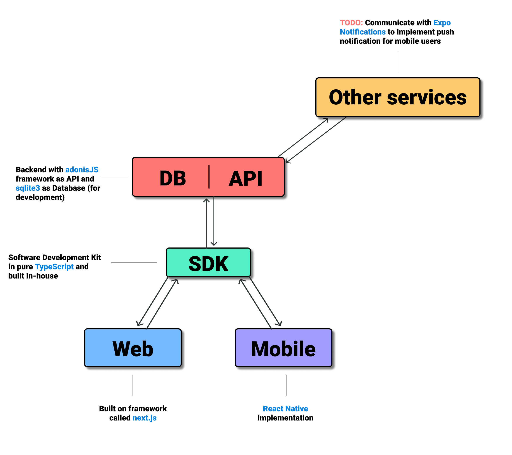
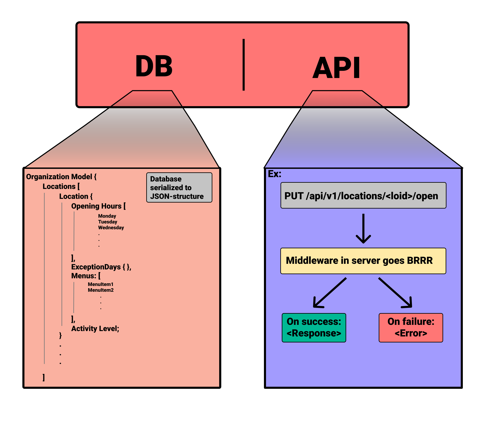

# Documentation
Contains documentation and research material for the project, e.g. API endpoints
and documentation related to code and structure.

## setup
In order to compile you need to have the `mobile`, `sdk`, `server` and `web` repositories in the same parent directory as the `docs` repository.
Also follow the sdk setup and installation guide to install the necessary dependencies.

## Commands
- `npm run compile` - Compiles the documentation for every projects into `public/`
- `npm run serve` - Starts a simple HTTP server in `public/` for testing

## Current System Architecture

### Closer look at the DB/API

